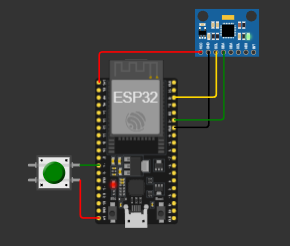

# Relatório do Candidato

## Identificação do Candidato

- **Nome completo:** Joison Júnior Cavalcanti Rodrigues
- **GitHub:** JoisonJr

---

## Visão Geral da Solução

- Objetivo do projeto: Monitora a temperatura do ambiente com um MPU6050 e a abertura de uma porta, emitindo alertas em casos "perigosos" (porta aberta por muito tempo ou variação abrupta na temperatura);
- Funções do sistema embarcado: Mede a temperatura ambiente e emite um alerta caso a temperatura fique instável e controla o fechamento e abertura de uma porta, além de também emitir um alerta caso esteja aberta por muito tempo;
- Interação com usuário: A única interação com o usuário presente no sistema é por meio de um botão que determina se a porta está aberta ou não;

---

## Arquitetura do Sistema Embarcado

De forma geral, o programa pode ser "dividido" em quatro funções:
- **checkBotao()**: É a responsável por abrir e fechar a porta. Guarda o momento em que a a porta foi aberta na variável tsAbertura com time.ticks_ms(), que retorna o instante atual de execução do programa em milissegundos para verificar quando o alarme será acionado em checkPortaAberta(), e altera o estado da variável global portaAberta;
```python
def checkBotao():
    global portaAberta, tsAbertura
    # Vale destacar que, agora com essa função dentro do while true:, que tem um sleep dentro, não é 
    # mais necessário implementar o debounce dentro da função para checar o botão
    portaAtual = (btn1.value() == 0)
    # Verifica se a porta foi aberta no instante atual para guardar o tempo de abertura e verificar
    # o momemto em que o alarme deverá ser ativado
    if portaAtual and not portaAberta:
        tsAbertura = time.ticks_ms()
    portaAberta = portaAtual

```
- **checkAlarmePortaAberta()**: Subtrai o tempo atual de execução do tempo em que a porta foi aberta (tsAbertura) e verifica se ultrapassou o limte de tempo;
```python
def checkAlarmePortaAberta():
  global alarmePortaAberta
  # O alarme da porta aberta é ativo se o tempo atual - tempo de abertura foi maior ou
  # igual ao limite estabelecido
  if portaAberta == True:
    alarmePortaAberta = time.ticks_diff(time.ticks_ms(), tsAbertura) >= LIMITE_TEMPO_PORTA_MS
  else:
    alarmePortaAberta = False

```
- **getImuTemp()**: Lê a temperatura atual do IMU e compara com a de referência, que é obtida ao calcular a média das leituras anteriores. A quantidade de leituras anteriores é definida por MAX_LEITURAS, definida em 100. Caso a porta esteja aberto ou o valor seja anômalo, ele não será adicionado à lista;
```python
def getImuTemp():
  global somaLeituras, tempRef, alarmeTermico
  try:
    # Obtém o valor atual de temperatura do MPU6050
    tempAtual = imu1.read_temperature()

    # Caso exista alguma leitura anterior já existente, é feita a verificação. Como a verificação 
    # serve apenas para o sobreaquecimento dos componentes, como estava na descrição do README,
    # não é necessário usar abs()
    if len(listaLeituras) > 0:
        alarmeTermico = (tempAtual - tempRef) >= LIMITE_VARIACAO_TEMP

    # Coleta a temperatura de referência apenas quando a porta estiver fechada
    if not portaAberta and not alarmeTermico:
        # Anexa a leitura atual à lista e, caso a lista esteja cheia, descarta a leitura mais antiga
        listaLeituras.append(tempAtual)
        somaLeituras = somaLeituras + tempAtual
        # Caso a lista de leituras fique cheia, subtrai o valor da leitura mais antiga e o retira da
        # lista de leituras
        if len(listaLeituras) > MAX_LEITURAS:
            somaLeituras = somaLeituras - listaLeituras.pop(0)
        
        # Atualiza a temperatura de referência
        tempRef = somaLeituras / len(listaLeituras)
  except Exception as e:
    print("Erro ao ler o MPU6050: ", e)

```
- **printStatus()**: Por fim, imprime as mensagens de acordo com os estados das variáveis utilizadas (alarmePortaAberta, alarmeTermico, estadoAnterior, alarmePortaAnterior e alarmeTermicoAnterior). As variáveis que têm "Anterior" no nome são utilizadas para evitar a impressão repetida de uma mensagem, e a atualização destas é feita no final da função;
```python
def printStatus():
  global alarmePortaAberta, alarmeTermico, estadoAnterior
  global alarmePortaAnterior, alarmeTermicoAnterior
  # Toda essa "lógica" de um tipo de alarme e seu anterior é para evitar uma "contínua impressão"
  # do alarme enquanto o sistema está neste estado, e a variável estadoAnterior é utilizada para
  # imprimir a mensagem de sistema normalizado depois do término de um alerta
  if alarmePortaAberta and not alarmePortaAnterior:
    print("ALERTA: Porta aberta por muito tempo!")
  if alarmeTermico and not alarmeTermicoAnterior:
    print("ALERTA: Degradacao termica detectada!")
  if not (alarmePortaAberta or alarmeTermico) and estadoAnterior:
    print("Status: Sistema Normalizado.")

  # Por fim, os alarmes anteriores são atualizados com os estados atuais para a próxima iteração, 
  # bem como o estadoAnterior
  alarmePortaAnterior = alarmePortaAberta
  alarmeTermicoAnterior = alarmeTermico
  estadoAnterior = alarmePortaAberta or alarmeTermico

```
Todas essas funções são executadas dentro do loop principal, no qual também está presente time.sleep_ms(50), paralisando o programa por 50 milissegundos. Não há interação direta entre o botão e o MPU6050, e os dois interagem diretamente com o ESP32.
```python
# Por fim, o loop executa todas as funções criadas anteriormente
while True:
    checkBotao()
    checkAlarmePortaAberta()
    getImuTemp()
    printStatus()
    time.sleep_ms(50)
```

---

## Componentes Utilizados na Simulação

Liste os principais componentes definidos no `diagram.json`, por exemplo:

- ESP32-DevKitC V4: Controla toda a lógica do funcionamento do sistema;
- MPU6050: Mede a temperatura ambiente;
- Push Button: Fecha e abre a porta;

    

---

## Decisões Técnicas Relevantes


- Inicialmente, pretendia utilizar uma interrupção para ler a mudança de estado da porta e um timer para cronometrar o tempo em que ficou aberta, mas aprendi que não é boa prática utilizar código que aloque memória dentro de interrupções (que é o caso de um timer), e tive problemas ao aplicar um debouncer ao botão, portanto substituí o timer por uma lógica que analisa o tempo em que a porta foi aberta (guardado em tsAbertura) e verifica se, com base no tempo atual, o alarme deve ser ativado ou não, e a interrupção foi substituída por um simples polling no loop principal.
- Para obter a temperatura de referência, usei uma lista para guardar as últimas medições e calculei sua média. Assim, o sistema emitirá um alarme no momento em que a temperatura sair desse limite, mas caso se estabilize nessa nova temperatura, a mensagem de sistema normalizdo será impressa. Além disso, como a temperatura de referência deve ser coletada enquanto a porta estiver fechada, a lista será atualizada apenas quando esta condição for cumprida, e para evitar que valores com aumento repentino influenciem no cálculo da temperatura de referência, eles também não serão adicionados à lista.
- Os estados dos alarmes são definidos pelas variáveis alarmePortaAberta e alarmeTermico, e seus estados anteriores (alarmePortaAnterior e alarmeTermicoAnterior, bem como estadoAnterior, que guarda o estado anterior do sistema todo) são usados para imprimir as mensagens de alerta apenas uma vez na função printStatus(), como está no exemplo abaixo:
```python
 if alarmePortaAberta and not alarmePortaAnterior:
    print("ALERTA: Porta aberta por muito tempo!")
```

---

## Resultados Obtidos

O sistema funciona conforme o esperado, ativando o alarme quando a porta fica aberta por muito tempo, ou quando há um aumento repentino na temperatura, e imprimindo a mensagem de sistema normalizado apenas quando as duas "condições de risco" são normalizadas. Além disso, o sistema só salva a temperatura na lista já citada quando a porta fica fechada, dado que voltar a temperatura para um estado "normal" só tem efeito depois que a porta for fechada. De modo geral, o resultado saiu como o esperado, atendendo aos requisitos solicitados.

---

## Comentários Adicionais (Opcional)

- Durante o desenvolvimento do sistema, encontrei alguns problemas como a aplicação de debounce à função que lê o botão e muda o estado da porta, pois tentei fazer isso por meio de uma interrupção no acionamento do botão, mas ocorriam alguns erros como o acionamento do alerta da porta aberta, mesmo sem que o botão esteja pressionado, que me fez tirar a interrupção do programa e usar apenas uma função "normal" na execução; e impressão contínua das mensagens de alerta, que foi resolvido ao adicionar variáveis para checar o estado anterior de cada tipo de alarme, imprimindo uma mensagem apenas quando o estado atual (se for True) for diferente do passado (False).
- Uma importante limitação dessa solução é justamente a possível alteração constante da temperatura de referência, o que não seria adequado, por exemplo, para monitorar a temperatura ambiente de qualquer coisa que não suporte altas temperaturas, pois se a temperatura aumentar gradualmente, nenhum alarme será emitido.
- Dentre os principais aprendizados obtidos, destaco um maior entendimento do funcionamento e de como aplicar interrupçoes ao software, outras formas de implementar debouncing (embora não estejam presentes no código, estava pesquisando meios de implementá-las sem uma função bloqueante).


---

